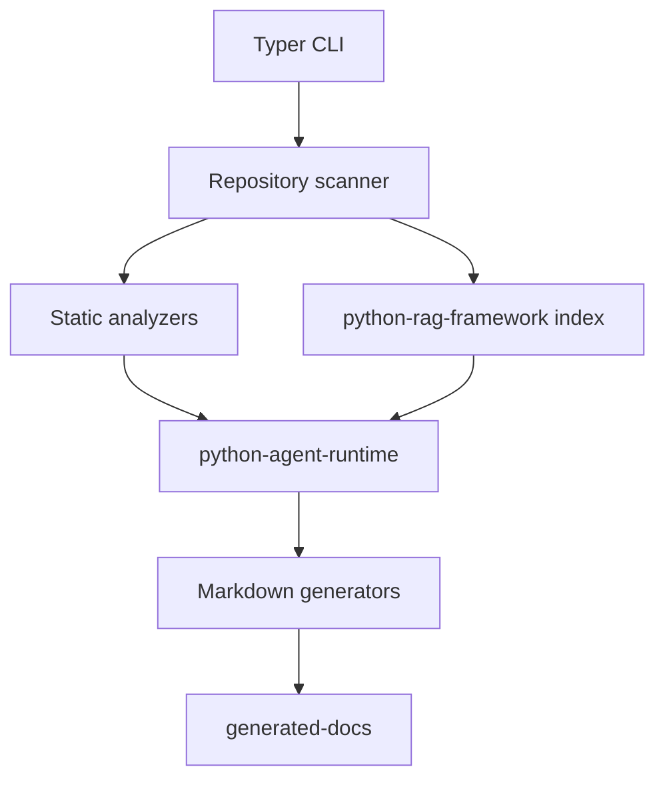

# Mermaid Diagrams

## Documentation Pipeline

```mermaid
flowchart TD
    cli["Typer CLI"] --> scanner["Repository scanner"]
    scanner --> analyzers["Static analyzers"]
    scanner --> rag["python-rag-framework index"]
    analyzers --> agent["python-agent-runtime"]
    rag --> agent
    agent --> markdown["Markdown generators"]
    markdown --> output["generated-docs"]
```

